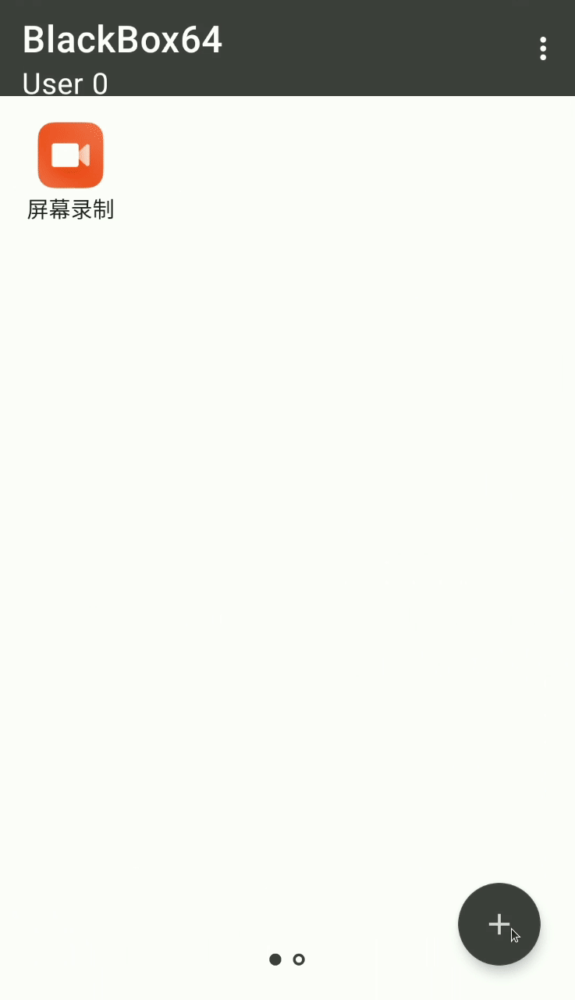

# NyxBox - Virtual Engine

<p align="center">
  
</p>

**NyxBox** is an Android virtual-engine / app-sandbox that lets you clone and run virtual applications **without installing the APK on the device**. It works on Android 5.0 (API 21) up to Android 15+ and supports multiple architectures (ARM64, ARMv7, x86).

> ⚠️ **No bundled cheats / anti-cheat bypass.** NyxBox is a *generic application-virtualization engine* (an open-source BlackBox fork). It does **not** ship any game anti-cheat bypass or third-party cheat payloads. Like any sandbox, whatever app a user chooses to install inside the virtual environment is their own responsibility — the engine itself contains no cheat code.

## Overview

This edition focuses on **stability, bug fixes, and modern-device compatibility** (Android 14/15). It incorporates generic engine/compatibility improvements from the BLACK-OPNE fork (virtualization, compat helpers, UID spoofing, crash hardening) while dropping anything cheat-related.

### Key Features

*   **Virtual App Cloning**: Run multiple instances of applications in an isolated space.
*   **Sandboxed Environment**: Isolated process / UID execution.
*   **No Root Required**: Runs entirely in userspace.
*   **Multi-Architecture**: 32-bit and 64-bit app support.
*   **Device Spoofing**: Modify device information for virtual apps.
*   **Fake Location**: Spoof GPS coordinates.
*   **SDK Detection Hardening**: Extra protections against common SDK detection.

## Requirements

*   **Android Version**: Android 5.0 (API 21) or higher.
*   **RAM**: 2 GB minimum recommended.
*   **Architecture**: ARMv7-a, ARM64-v8a, x86.

## Build Instructions

### Prerequisites
*   Android Studio (Arctic Fox or newer)
*   JDK 21
*   Android SDK Platform 34 / 35
*   NDK `29.0.13846066`
*   CMake `3.22.1`

### Building from Source

```bash
# Clone the repository
git clone https://github.com/ravipacharpro-jpg/NyxBox.git
cd NyxBox

# Build Debug APK (Loader)
./gradlew :app:assembleDebug

# Build Release AAR (Core engine)
./gradlew :core:assembleRelease
```

A ready-to-flash Debug APK is produced automatically by GitHub Actions (see the **NyxBox Android Build** workflow) and published as a workflow artifact.

## Project Structure

| Module        | Purpose                                                      |
|---------------|--------------------------------------------------------------|
| `app`         | Loader / UI (package `com.nyxbox.app`)                       |
| `core`        | Virtual-engine core (package `com.nyxbox`)                   |
| `reflection`  | Reflection helpers (`com.nyxbox.reflection`)                 |
| `compiler`    | Compile-time annotation processor                           |

## Developer

*   **Telegram**: [@L359D](https://t.me/L359D)

## Credits

*   **Rebrand / Maintenance**: NyxBox (@L359D)
*   **Original Framework**: BlackBox / VirtualApp, VirtualAPK
*   **Native Hooks**: Dobby, xDL
*   **Reflection**: BlackReflection, FreeReflection
*   **Generic engine improvements**: BLACK-OPNE fork (compatibility / stability only)

## License

Copyright 2022 BlackBox

Licensed under the Apache License, Version 2.0 (the "License");
you may not use this file except in compliance with the License.
You may obtain a copy of the License at

   http://www.apache.org/licenses/LICENSE-2.0

Unless required by applicable law or agreed to in writing, software
distributed under the License is distributed on an "AS IS" BASIS,
WITHOUT WARRANTIES OR CONDITIONS OF ANY KIND, either express or implied.
See the License for the specific language governing permissions and
limitations under the License.
